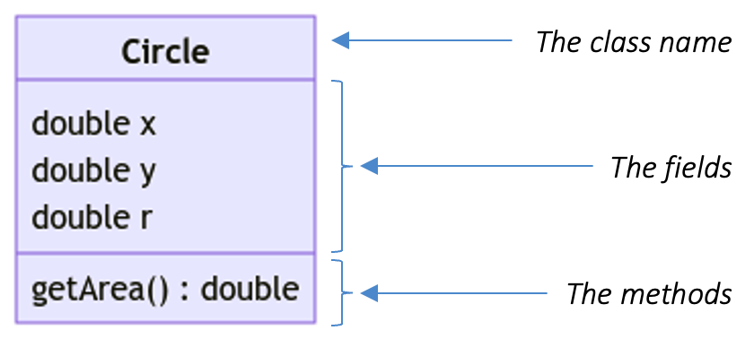

!!! note "Class Diagram (Part 1)"

    A useful diagram to have when trying to visualize a class is called the class diagram.  A class diagram consists of 3 segments:

    1. The class name.
    2. The fields.
    3. The methods.

    In between each segment, we draw a line to clearly delimit each segment.  For the best result, the order in which the fields and methods appear should be identical to how they appear in the code.

    Additionally, we omit the implementation of the method and record only the minimal information needed.  Otherwise, there is no difference between class diagram and code.  What we want is to have a diagram that captures the essence of a class so that we can reason about our design without actually writing the code.

    For instance, consider the class `Circle` v0.1 above (reproduced below).

    ```Java
    // Circle v0.1
    class Circle {
      double x;
      double y;
      double r;

      double getArea() {
        return 3.141592653589793 * r * r;
      }
    }
    ```

    The corresponding class diagram is shown below.

    { width=400px }

    We will improve upon this class diagram with additional details while keeping the amount of information minimal to avoid information overload.

    We encourage you to practice drawing class diagrams from code and writing code from class diagrams.  This will be a useful design tool when dealing with larger programs, especially those involving multiple files.  It will take more time to debug your code so a good design will save time.