# Linking Your PE Account to Your GitHub Account

## Prerequisites

1. You should already have your SoC Unix account, cluster access, and SoC VPN set up, and be able to `ssh` into one of the PE hosts.  If you are not able to do this, please look at the guide on [programming environments](environments.md).
2. You should feel comfortable running basic UNIX commands.  If you have not gone through the UNIX guide and got your hands dirty, please [look at the guide and play with the various basic Unix commands](../unix/essentials.md).
3. You should already have a GitHub account and can log into [GitHub.com](https://www.github.com).
4. {++You know how to create and edit a file in Vim++}

## Purpose

You will be using `git` (indirectly) for retrieving skeleton code and submitting completed assignments.  We will set up your accounts on a PE host below so that `git` will be associated with your GitHub account.  This is a one-time setup.  You don't have to do this for every assignment.

## 1. Setting up `.gitconfig`

Create and edit a file called `.gitconfig` in **your home directory on the PE host**, with the following content:

```text
[user]
  name = Your Name
  email = Your Email
[github]  
  user = Your GitHub Username
```

Your email should be whatever you used to sign up on GitHub (which may not be your SoC or NUS email).

For example, a sample `.gitconfig` looks like this:

```text
[user]
  name = Elsa
  email = queen@arendelle.gov
[github]  
  user = elsasnow16
```

After saving this file, run:

```
git config --get github.user
```

It should return your GitHub username.

It should print your GitHub username as already set.  If there is a typo, you need to edit `.gitconfig` again and reload it by repeating the command above.

## 2. Setting up Password-less Login

### Setting up Token

1. Login to [GitHub.com](https://www.github.com) using your account.  Ensure that you are using the account you registered for CS2030S.

2. Click on your avatar on the top right corner.

    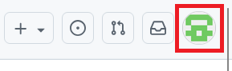

3. Click on "**Setting**" from the dropdown menu.  This will bring you to profile page.

    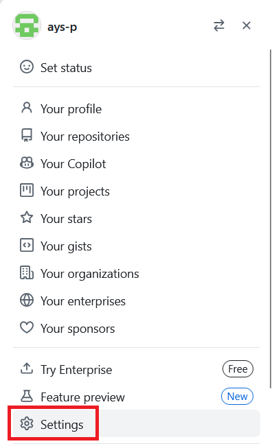

4. On the sidebar on the left, click on "**Developer settings**".  You may need to scroll down as it is at the bottom.  This will bring you to github app page.

    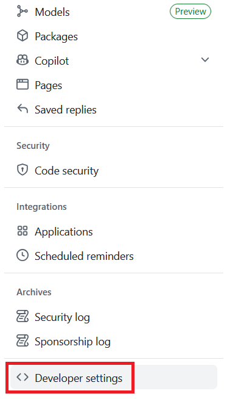

5. On the sidebar on the left, expand on "**Personal access tokens**".  Then click on "**Tokens (classic)**".  This will bring you to personal access tokens page.

    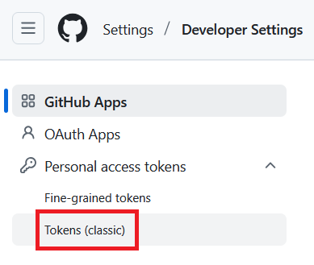

6. Currently, there should not be any personal access token created.  Expand on "**Generate new token**".  If you already have a token, you should see the image on the right.

    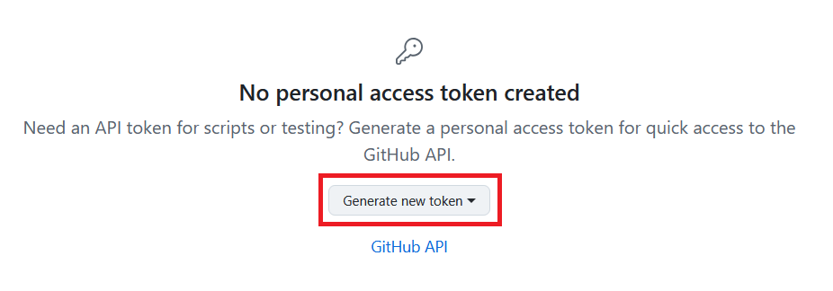{width=45%} 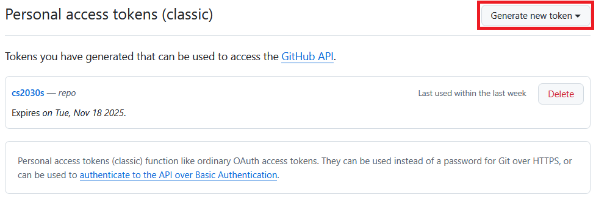{width=45%}

7. Click on "**Generate new token (classic)**".

    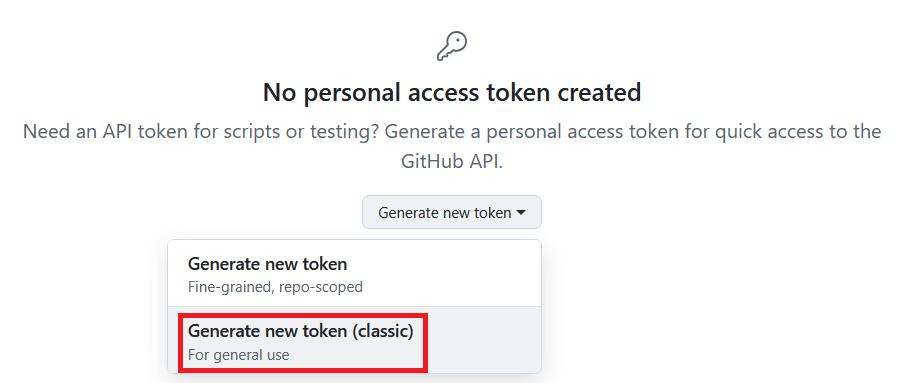

8. Fill in "**Note**" with meaningful name.  Set "**Expiration**" to 90 days.  Check the "**repo**" in "**Select scopes**".

    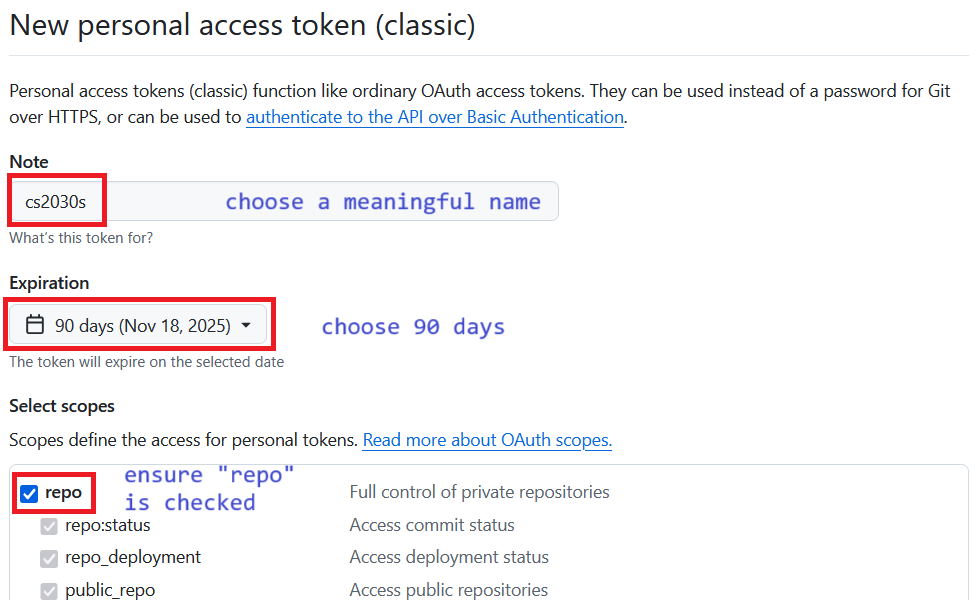

9. Your personal access token will be created.  **Save this!**  We will be using it later.

    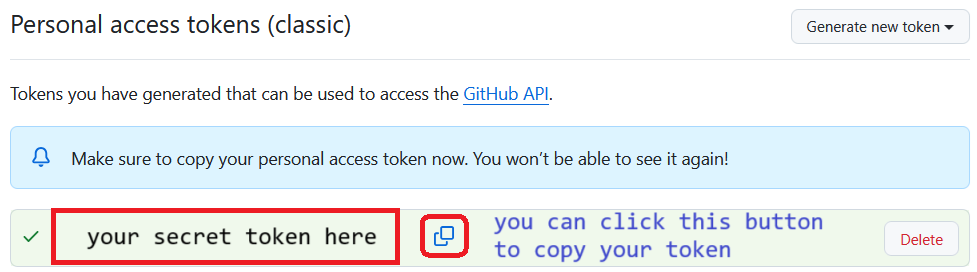

{++SSH login no longer works.  Use token and credential manager technique above.  We will store this in credential manager.  But for your first connection, you will be prompted a password.  Enter (or paste) your token as password to be stored in credential manager.++}


## 3. Accept and Retrieve a Test Skeleton from GitHub

We have created an empty lab for you to test if you can correctly retrieve future lab files from GitHub.  Complete the following steps:

- Click here [https://classroom.github.com/a/uOrkMKIa](https://classroom.github.com/a/uOrkMKIa).  You should see a page that looks like the following:

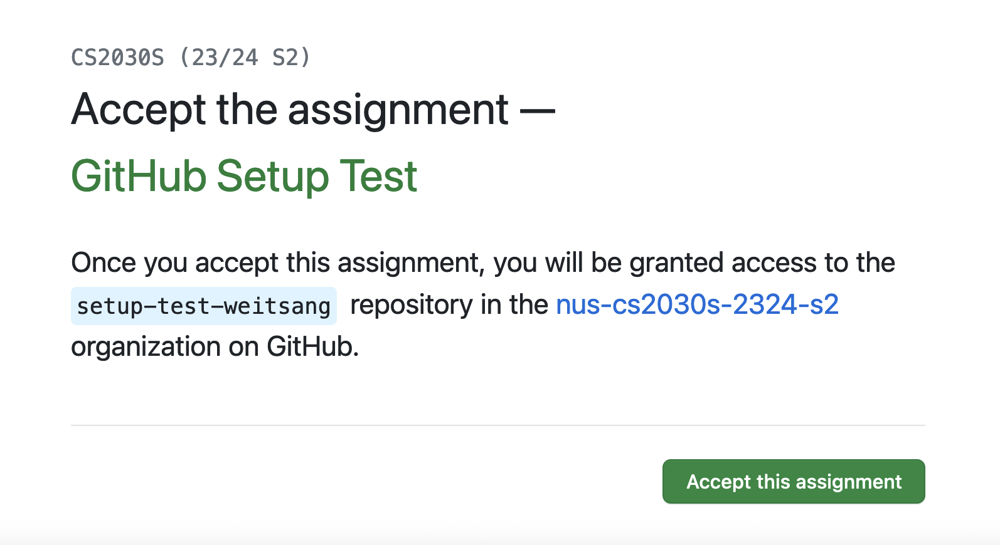{: style="width:500px"}

- Click the accept button.  Wait a bit and then refresh until you see a "You're ready to go" message.

{++We will now try to initialize this on PE host.  You will need your personal access token on the next few steps.++}

- {++On your PE host, initialize the credential manager.++}

```Bash
git config --global credential.helper store
```

- {++Run the following command to clone into `setup-test`.++}

```Bash
/opt/course/cs2030s/get setup-test
```

{++You will then be asked for your username and password.++}

{++For the username, enter your **github username**.  For the password, enter or copy your personal access token.  Note that there will be nothing written for password.++}

{++If everything works well, you should see:++}

```
Cloning into 'setup-test-<username>'...
Username for 'https://github.com': <username>
Password for 'https://<username>@github.com': <token>
remote: Enumerating objects: 9, done.
remote: Counting objects: 100% (9/9), done.
remote: Compressing objects: 100% (5/5), done.
remote: Total 9 (delta 1), reused 6 (delta 0), pack-reused 0 (from 0)
Receiving objects: 100% (9/9), done.
Resolving deltas: 100% (1/1), done.
```

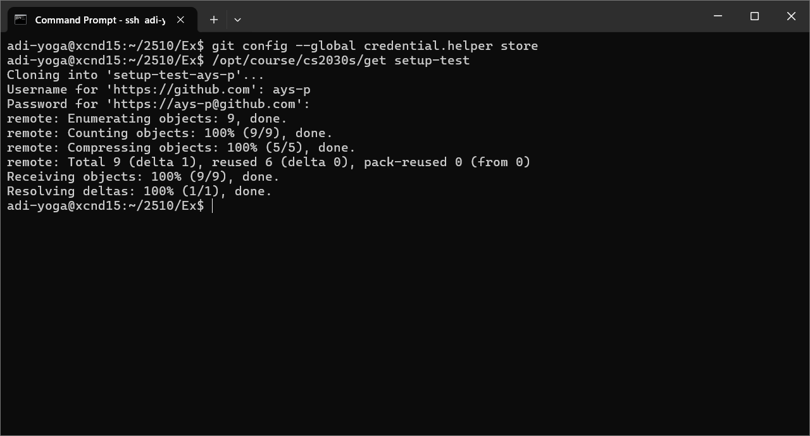

{++If you have followed the steps above correctly, any subsequent cloning of github repository does not require username and password to be inserted anymore.  You can test by accepting ex0 and cloning it once it is ready.++}