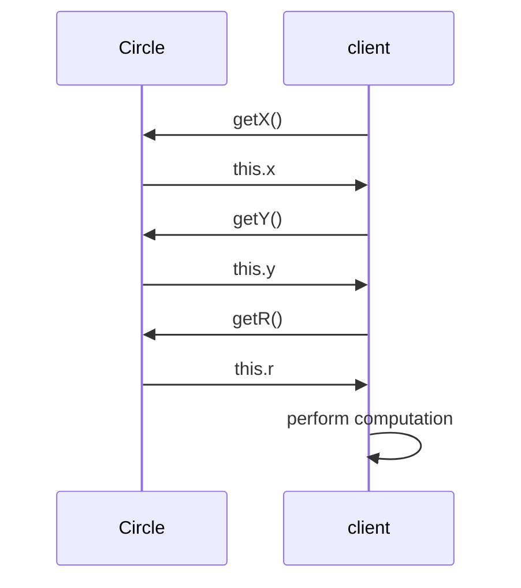
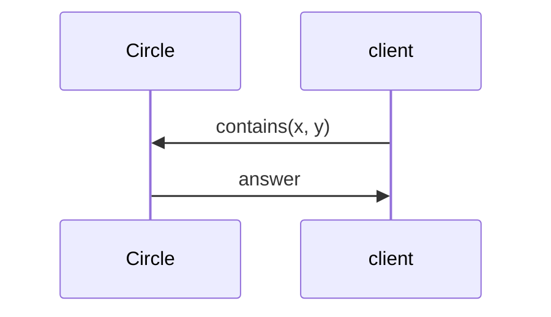

# Unit 6: Tell, Don't Ask

!!! abstract "Learning Objectives"

    After this unit, students should

    - understand what accessor and mutator are used for, and why not to use them.
    - understand the principle of "Tell, Don't Ask".

## Accessors and Mutators

Similar to providing constructors, a class should also provide methods to retrieve or modify the properties of the object.  These methods are called the _accessor_ (or _getter_) or _mutator_ (or _setter_).

The use of accessor and mutator methods is a bit controversial.   Suppose that we provide an accessor method and a mutator method for every private field, then we are exposing the internal representation, therefore breaking the encapsulation.  For instance:

```Java title="Circle v0.4" hl_lines="12-14 16-18"
class Circle {
  private double x;
  private double y;
  private double r;

  public Circle(double x, double y, double r) {
    this.x = x;
    this.y = y;
    this.r = r;
  }

  public double getX() {       // accessor
    return this.x;
  }

  public void setX(double x) { // mutator
    this.x = x;
  }

  // getY, setY, getR, and setR are omitted

  public double getArea() {
    return 3.141592653589793 * this.r * this.r;
  }
}
```

In the code above, we can categorise the accessor and mutator of each field as follows.

| Fields | Accessors | Mutators |
|--------|-----------|----------|
| `x` | `getX` | `setX` |
| `y` | `getY` | `setY` |
| `r` | `getR` | `setR` |

Do note that the name `getProp` or `setProp` for a field prop is _optional_.  But it is a good practice.  For instance, we may actually name the accessor for `r` as `radius` and the mutator as `resize` shown below.

```java
public double radius() {        // accessor
  return this.r;
}

public void resize(double r) {  // mutator
  this.r = r;
}
```

### Accessor/Mutator vs Public

As we have said above, having both accessor and mutator for a private field is controversial, it is still _better_ than setting the field `public`.  By having an accessor and a mutator, we are adding a layer of abstraction.  For instance, we can still rename a field without affecting the client.

Another advantage is that we may be able to perform some checks on the mutator and prevent certain invalid values from ever being assigned to the field.  Consider the method `setR` in our `Circle` v0.4 above.  A slightly better approach is to implement it with a check to prevent setting the radius to a non-positive value.

```java
public void setR(double r) {
  if (r > 0) {
    this.r = r;
  } else {
    // handle error
  }
}
```

Regardless, we should think carefully if an accessor or a mutator is really needed for a field.

### How Accessor/Mutator Can Be Harmful

Since having accessors/mutators is better than having public fields, does it mean that we should always provide an accessor and a mutator for every private field?

Let's consider a slightly different version of `Circle` where the center coordinate and radius are integers, perhaps because the implementer does not have the foresight that they need to be floating-point numbers.

```java title="Circle v0.4.1 (with Integer Coordinate)"
class Circle {
  private int x;
  private int y;
  private int r;

  public Circle(int x, int y, int r) {
    this.x = x;
    this.y = y;
    this.r = r;
  }

  public int getX() {
    return this.x;
  }

  public void setX(int x) {
    this.x = x;
  }

  public int getY() {
    return this.y;
  }

  // getY, setY, getR, and setR are omitted

  public double getArea() {
    return 3.141592653589793 * this.r * this.r;
  }
}
```

Suppose a client of the class wishes to check if, given a point (x,y), does it fall within the circle c? One approach would be the following.

```java title="Client Code v0.1"
int cX = c.getX();
int cY = c.getY();
int r = c.getR();
boolean isInCircle = ((x - cX) * (x - cX) + (y - cY) * (y - cY)) <= r * r;
```

One day, the implementer realized that the coordinates and radius should be floating-point numbers and changed the fields to `double`, and revised the `Circle` implementation to v0.4 shown earlier. The client code above will break! Since the accessors now return `double` values, but the client assigned the returned values to `int`. 

Thus, having accessors/mutators in a class inevitably can leak some information about the internal details of the class to the client. This is a form of coupling between the client and the class. In the example above, the client code depends on the fact that the center coordinates and radius are represented as `int`. Any change to the internal structure will break the client code.

Thus, we should think carefully if an accessor or a mutator is really needed for a field, i.e., does the client really need to access or modify something that is internal to the class? 


## The "Tell, Don't Ask" Principle

One guiding principle to whether the implementer should provide and whether the client should call the accessor and mutator is the "Tell, Don't Ask" principle. This principle suggests that we should tell an object what to do, instead of asking an object for its state and then performing the task on its behalf.

Let's revisit the example above. This time, the (disgruntled) client has updated the code to use floating-point coordinates and radius.

```Java title="Client Code v0.2"
double cX = c.getX();
double cY = c.getY();
double r = c.getR();
boolean isInCircle = ((x - cX) * (x - cX) + (y - cY) * (y - cY)) <= r * r;
```

Here the client calls the accessor methods to ask for the values of the fields `x`, `y`, and `r` of the `Circle` object `c`, and then performs the computation to check if the point (x,y) is within the circle. 




Applying "Tell, Don't Ask" principle, a better approach would be to add a new `boolean` method in the `Circle` class, and call it instead as shown below.

```java
boolean contains(double x, double y) {
  double dx = x - this.x;
  double dy = y - this.y;
  return ((dx * dx) + (dy * dy)) <= this.r * this.r;
}
```

and let the client tell the `Circle` object to check if the point is within the circle. 

```Java
boolean isInCircle = c.contains(x, y);
```



This better approach involves writing a few more lines of code to implement the method, but it keeps the encapsulation intact, leading to less _coupling_ between the client and the class.  The client does not need to know the internal representation of the `Circle` class, and the `Circle` class can change its internal structure (e.g., the type of the fields) without affecting the client.

In general, _a task that is performed only on the fields of a class should be implemented in the class itself._

While there are situations where we cannot avoid using an accessor or a mutator in a class, for beginner OO programmers like yourself, it is better to not define classes with any accessor and modifier to the private fields and force yourselves to think in the OO way &mdash; to tell an object what task to perform as a client, and then implement this task within the class as a method as the implementer.

## Further Reading

- [Tell Don't Ask](https://martinfowler.com/bliki/TellDontAsk.html) by Martin Fowler
- [Why getters and setters are evil](https://www.infoworld.com/article/2073723/why-getter-and-setter-methods-are-evil.html), by Allen Holub, JavaWorld
- [Getters and setters are evil. Period](https://www.yegor256.com/2014/09/16/getters-and-setters-are-evil.html), by Yegor Bygayenko.
